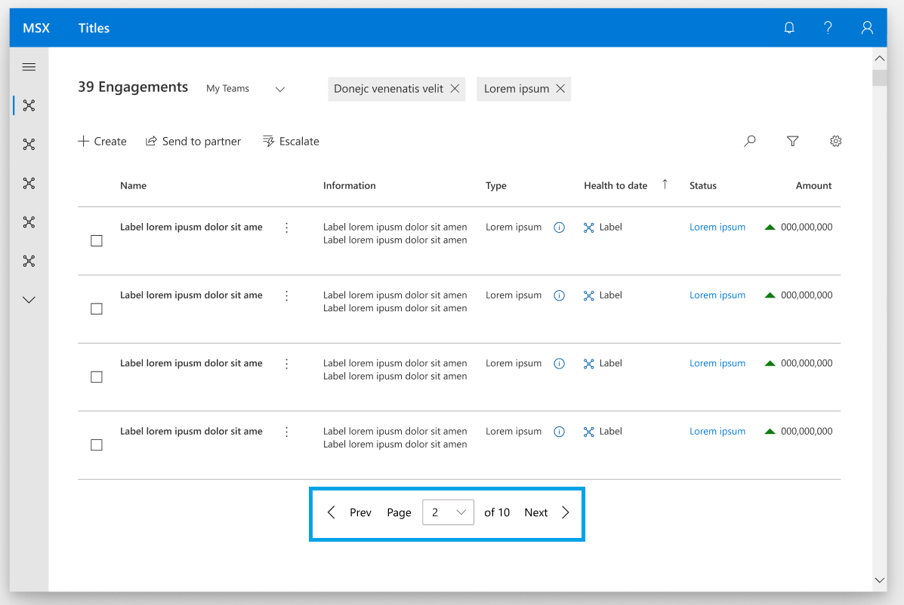
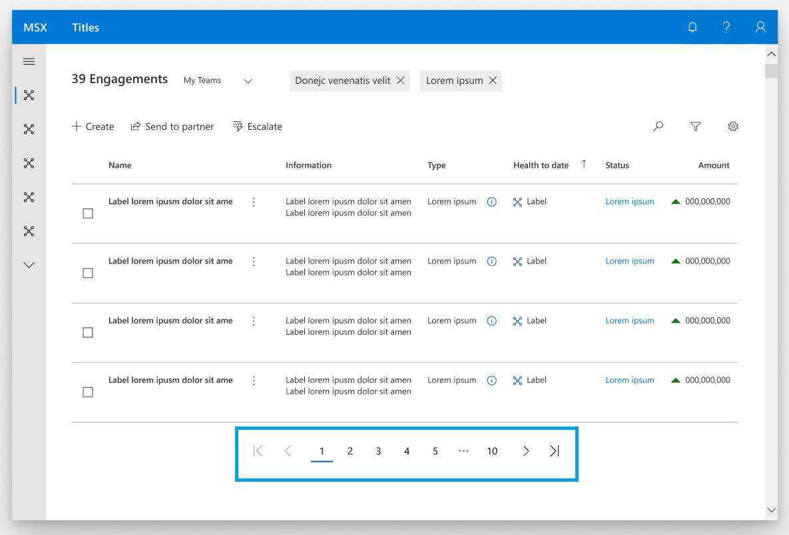
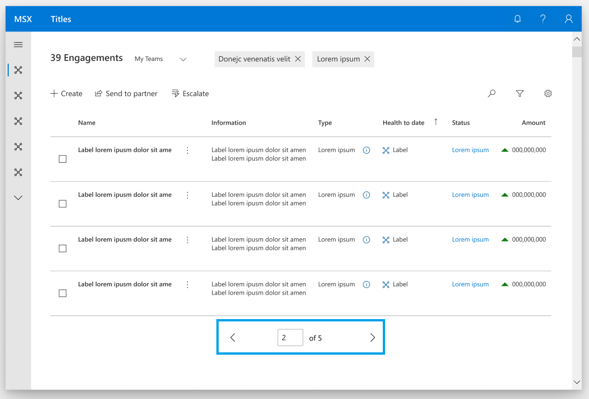

# Pager control

<!-- The purpose of this spec is to describe a new feature and
its APIs that make up a new feature in WinUI. -->

<!-- There are two audiences for the spec. The first are people
that want to evaluate and give feedback on the API, as part of
the submission process.  When it's complete
it will be incorporated into the public documentation at
docs.microsoft.com (http://docs.microsoft.com/uwp/toolkits/winui/).
Hopefully we'll be able to copy it mostly verbatim.
So the second audience is everyone that reads there to learn how
and why to use this API. -->

## Background

A UI pager is a common control that lets a user page through a long list, rather than scroll or pan. A common experience is to provide preview/next buttons, and a way to jump to a specific page.
<!-- Use this section to provide background context for the new API(s) 
in this spec. -->

<!-- This section and the appendix are the only sections that likely
do not get copied to docs.microsoft.com; they're just an aid to reading this spec. -->

<!-- If you're modifying an existing API, included a link here to the
existing page(s) -->

<!-- For example, this section is a place to explain why you're adding this API rather than
modifying an existing API. -->

<!-- For example, this is a place to provide a brief explanation of some dependent
area, just explanation enough to understand this new API, rather than telling
the reader "go read 100 pages of background information posted at ...". -->

The absence of a standard WinUI pager control, last seen in Xaml as DataPager in Silverlight, has been a pain point in both WPF and UWP that has forced a variety of unfavorable workarounds for developers. Inclusion of this control in UWP would resolve an ecosystem gap and enable developers to efficiently deliver UI paging experiences in their applications. Through XAML Islands, it may also provide an opportunity to benefit WPF developers working with DataGrid or ListView. The scope of this proposal is not to provide a data paging solution at this time, but to start with UI paging as a foundation on top of which data paging may be later integrated.


## Description
<!-- Use this section to provide a brief description of the feature.
For an example, see the introduction to the PasswordBox control 
(http://docs.microsoft.com/windows/uwp/design/controls-and-patterns/password-box). -->

Use PagerControl to provide the user with a way to page through large content. This can be configured to navigate pages for several view controls.

**Important APIs:** [PagerControl class](https://docs.microsoft.com/en-us/uwp/api/microsoft.ui.xaml.controls.pagercontrol)

Pager control can be configured to use a ComboBox, NumberBox, or numeric Button panel as the core pager control.

## Is this the right control? 

Use a **PagerControl** to create an accessible navigation interface for views that have multiple pages to display. 

## Examples
<!-- Use this section to explain the features of the API, showing
example code with each description. The general format is: 
  feature explanation,
  example code
  feature explanation,
  example code
  etc.-->
  
<!-- Code samples should be in C# and/or C++/WinRT -->

<!-- As an example of this section, see the Examples section for the PasswordBox control 
(https://docs.microsoft.com/windows/uwp/design/controls-and-patterns/password-box#examples). -->

A pager control can have several configurations, including these notable ones. 

### ComboBox Pager Control



XAML
```XAML
<GridView x:Name="gridView1" ... />
<controls:PagerControl x:Name="MainPagerControl"
        DisplayMode="ComboBox"
	NumberOfPages="10"
        FirstButtonVisibility="None"
        PreviousButtonVisibility="AlwaysVisible"
        PreviousButtonText="Prev"
        NextButtonVisibility="AlwaysVisible"
        NextButtonText="Next"
        LastButtonVisibility="None"
	FirstButtonCommand="FirstButtonPressedEvent"
        PreviousButtonCommand="PreviousButtonPressedEvent"
        NextButtonCommand="NextButtonPressedEvent"
        LastButtonCommand="LastButtonPressedEvent"
        PagerInputCommand="PagerInputEvent"
	Prefix="Page"
	Suffix="of 10"/>
</Grid>
```

### Numerical Button Panel Pager Control



XAML
```XAML
<GridView x:Name="gridView1" ... />
<controls:PagerControl x:Name="MainPagerControl"
        DisplayMode="NumericalButtonPanel"
	NumberOfPages="10"
        FirstButtonVisibility="AlwaysVisible"
        PreviousButtonVisibility="AlwaysVisible"
        NextButtonVisibility="AlwaysVisible"
        LastButtonVisibility="AlwaysVisible"
        FirstButtonCommand="FirstButtonPressedEvent"
        PreviousButtonCommand="PreviousButtonPressedEvent"
        NextButtonCommand="NextButtonPressedEvent"
        LastButtonCommand="LastButtonPressedEvent"
        PagerInputCommand="PagerInputEvent"
        EllipsisEnabled="True"
	EllipsisShowFirstAndLast="True"
        NumberOfIndicesShowing="6"
	EllipsisMaxBefore="5"
	EllipsisMaxAfter="1"/>
</Grid>
```

### Editable NumberBox Pager Control



XAML
```XAML
<GridView x:Name="gridView1" ... />
<controls:PagerControl x:Name="MainPagerControl"
        DisplayMode="NumberBox"
        NumberOfPages="5"
	FirstButtonVisibility="None"
        PreviousButtonVisibility="AlwaysVisible"
        NextButtonVisibility="AlwaysVisible"
        LastButtonVisibility="None"
	FirstButtonCommand="FirstButtonPressedEvent"
        PreviousButtonCommand="PreviousButtonPressedEvent"
        NextButtonCommand="NextButtonPressedEvent"
        LastButtonCommand="LastButtonPressedEvent"
        PagerInputCommand="PagerInputEvent"
	Suffix="of 5"/>
</Grid>
```

## Adding a PagerControl to Your Application

Here is an example for how to add the PagerControl to your application. It can be added on the page as shown below, or can be used in the template of the layout view you prefer to use. PagerControl is added to the template for DataGrid and ItemsRepeater in WinUI 2.x and will be added to ListView and GridView in WinUI 3. 

(Insert XAML and code behind example here. This will also be added to the XAML controls gallery.)


## Remarks
<!-- Explanation and guidance that doesn't fit into the Examples section. -->

<!-- APIs should only throw exceptions in exceptional conditions; basically,
only when there's a bug in the caller, such as argument exception.  But if for some
reason it's necessary for a caller to catch an exception from an API, call that
out with an explanation either here or in the Examples -->

### Adding a PagerControl to Your Application

Here is the XAML to show how to add the PagerControl to your application. It can be added on the page as shown below, or can be used in the template of the layout view you prefer to use. PagerControl is added to the template for DataGrid and ItemsRepeater in WinUI 2.x and will be added to ListView and GridView in WinUI 3. 

## API Notes
<!-- Option 1: Give a one or two line description of each API (type
and member), or at least the ones that aren't obvious
from their name.  These descriptions are what show up
in IntelliSense. For properties, specify the default value of the property if it
isn't the type's default (for example an int-typed property that doesn't default to zero.) -->

<!-- Option 2: Put these descriptions in the below API Details section,
with a "///" comment above the member or type. -->
| Name | Description|
|:---:|:---|
| PagerDisplayMode | Enum that contains 4 values (Auto, ComboBox, NumberBox, ButtonPanel) that the developer can change to fit their scenario. When auto is selected, the display mode will be ComboBox. The control will default to auto. 
| NumberOfPages | Sets the max number of pages the index control will iterate through. 
| ButtonVisibilityMode | Enum (Auto, AlwaysVisible, HiddenOnLast, None) that allows the app developer to hide or show the first, last, next, and previous buttons. When auto is selected, the visibility mode will be AlwaysVisible. The control will default to auto.  
Button Commands
| First, Previous, Next, and Last ButtonCommand | Specially handle the button pressed event for when the end user selects the first button. 
| First, Previous, Next, and Last ButtonGlyph | Give the developer the option to customize the control by changing the glyph for the first button. 
| First, Previous, Next, and Last ButtonText | Give the developer the option to customize the control by changing the text for the first button. 
| NumberOfIndicesShowing | Determine the number of indices showing in the number panel display mode. If the max number of pages is 10 but the number of indices is 5, the number panel will show 1,2,3,4,5 and when the user selects next, the indices will be 2,3,4,5,6. 
| EllipsisEnabled | Boolean to display the ellipses for the buttonpanel display mode. 
| EllipsisShowFirstAndLast | Boolean to display the first and last index of a buttonpanel if the ellipsis is enabled. 
| EllipsisMaxBefore | How many indices are shown before the ellipses. 
| EllipsisMaxAfter | How may indices are shown after the ellipses. 
| SelectedIndex | The index that is currently selected. By default this value will be 1. 
| PrefixText | Developer can change the prefix text for the combobox display mode option. 
| SuffixText | Developer can change the suffix text for the combobox display mode option. 
| SelectedIndex| The index that the user has navigated to and is currently viewing. 
| PagerControlPageChangedEvent | Event that is fired when the end user selects a button from the number panel, any of the 4 directional buttons, or selects an option from the combobox or enters a number in the numberbox. This event will return the index number that the end user selected. If the end user enters a number greter than the number of pages this event will return the last page. If the end user enters a number less than 1 the event will return 1. 

### Visual Components

 | Component |  Notes |
|:---:|:---|
| DisplayMode | * Used to set a button panel, editable ComboBox (default), or NumberBox, as the indexing component. <br> * When set to be a button panel, the number of visible indices can be specified. <br><br>  &nbsp;&nbsp;&nbsp;&nbsp;&nbsp;&nbsp;&nbsp;&nbsp;  |
| LastButton | * Button displaying text and/or glyph indicating that the user may navigate to the last index. <br> * Automatically disabled when at last index. <br> * Can be set to not be visible when at the last index.  <br><br>  |
| FirstButton | * Button displaying text and/or glyph indicating that the user may navigate to the first index. <br> * Automatically disabled when at first index. <br> * Can be set to not be visible when at the first index.  <br><br>  |
| NextButton | * Button displaying text and/or glyph indicating that the user may navigate to the next index. <br> * Automatically disabled when at last index. <br> * Can be set to not be visible when at the last index. <br><br>  |
| PreviousButton | * Button displaying text and/or glyph indicating that the user may navigate to the previous index. <br> * Automatically disabled when at first index. <br> * Can be set to not be visible when at the first index.  <br><br>  |
| Ellipsis | * Button, often reading "...", used between indexes and before or after the first/last index to indicate an accessible but omitted range of indexes. <br> * MaxBefore and MaxAfter properties can be used to set  how many indices appear between the current page and the ellipsis before/after it. <br> * Visibility of the first/last index can be disabled. <br> <br> * Only visible when using button panel as the display mode.  <br><br>  |
| PrefixText | * Text displayed before the editable ComboBox indexing component. <br><br>  |
| NumberOfPages | * When a total number of indices (N) is given, this suffix string will appear after the editable ComboBox indexing component and read "of N". Localization will put "N" where it should be in a given language. <br><br>  |

## API Details
<!-- The exact API, in MIDL3 format (https://docs.microsoft.com/en-us/uwp/midl-3/) -->

```c++ 
enum PagerDisplayMode
{
    Auto,
    ComboBox,
    NumberBox,
    ButtonPanel,
};

enum ButtonVisibilityMode
{
    Auto,
    AlwaysVisible,
    HiddenOnLast,
    None,
};

runtimeclass PagerControlPageChangedEventArgs
{
    Integer CurrentPage{get; }:
}

runtimeclass PagerControl
{
    PagerControl();

    PagerDisplayMode Display;
    
    Integer NumberOfPages;
    
    ButtonVisibilityMode FirstButtonVisibility;
    ButtonVisibilityMode PreviousButtonVisibility;
    ButtonVisibilityMode NextButtonVisibility;
    ButtonVisibilityMode LastButtonVisibility;

    FirstButtonCommand="FirstButtonPressedEvent"
    PreviousButtonCommand="PreviousButtonPressedEvent"
    NextButtonCommand="NextButtonPressedEvent"
    LastButtonCommand="LastButtonPressedEvent"
    PagerInputCommand="PagerInputEvent"
    
    IconSource FirstButtonGlyph;
    IconSource PreviousButtonGlyph;
    IconSource NextButtonGlyph;
    IconSource LastButtonGlyph;
    
    String FirstButtonText;
    String PreviousButtonText;
    String NextButtonText;
    String LastButtonText;

    Windows.UI.Xaml.Input.ICommand FirstButtonCommand;
    Windows.UI.Xaml.Input.ICommand PreviousButtonCommand;
    Windows.UI.Xaml.Input.ICommand NextButtonCommand;
    Windows.UI.Xaml.Input.ICommand LastButtonCommand;
    Windows.UI.Xaml.Input.ICommand PagerInputCommand;
    
    Windows.UI.Xaml.Style FirstButtonStyle;
    Windows.UI.Xaml.Style PreviousButtonStyle;
    Windows.UI.Xaml.Style NextButtonStyle;
    Windows.UI.Xaml.Style LastButtonStyle;
    
    
    Integer NumberOfIndicesShowing;
    Boolean EllipsisEnabled;
    Boolean EllipsisShowFirstAndLast;
    Integer EllipsisMaxBefore;
    Integer EllipsisMaxAfter;
    Integer SelectedIndex;
    
    String PrefixText;
    String SuffixText;

    event Windows.Foundation.TypedEventHandler<PagerControl, PagerControlPageChangedEventArgs> PageChanged;

    static Windows.UI.Xaml.DependencyProperty DisplayProperty{ get; };
    
    static Windows.UI.Xaml.DependencyProperty NumberOfPagesProperty{ get; };
    
    static Windows.UI.Xaml.DependencyProperty FirstButtonVisibilityProperty{ get; };
    static Windows.UI.Xaml.DependencyProperty PreviousButtonVisibilityProperty{ get; };
    static Windows.UI.Xaml.DependencyProperty NextButtonVisibilityProperty{ get; };
    static Windows.UI.Xaml.DependencyProperty LastButtonVisibilityProperty{ get; };
    
    static Windows.UI.Xaml.DependencyProperty FirstButtonGlyphProperty{ get; };
    static Windows.UI.Xaml.DependencyProperty PreviousButtonGlyphProperty{ get; };
    static Windows.UI.Xaml.DependencyProperty NextButtonGlyphProperty{ get; };
    static Windows.UI.Xaml.DependencyProperty LastButtonGlyphProperty{ get; };
    
    static Windows.UI.Xaml.DependencyProperty FirstButtonTextProperty{ get; };
    static Windows.UI.Xaml.DependencyProperty PreviousButtonTextProperty{ get; };
    static Windows.UI.Xaml.DependencyProperty NextButtonTextProperty{ get; };
    static Windows.UI.Xaml.DependencyProperty LastButtonTextProperty{ get; };

    static Windows.UI.Xaml.DependencyProperty FirstButtonCommandProperty{ get; };
    static Windows.UI.Xaml.DependencyProperty PreviousButtonCommandProperty{ get; };
    static Windows.UI.Xaml.DependencyProperty NextButtonCommandProperty{ get; };
    static Windows.UI.Xaml.DependencyProperty LastButtonCommandProperty{ get; };
    static Windows.UI.Xaml.DependencyProperty PagerInputCommandProperty{ get; };
    
    static Windows.UI.Xaml.DependencyProperty FirstButtonStyleProperty{ get; };
    static Windows.UI.Xaml.DependencyProperty PreviousButtonStyleProperty{ get; };
    static Windows.UI.Xaml.DependencyProperty NextButtonStyleProperty{ get; };
    static Windows.UI.Xaml.DependencyProperty LastButtonStyleProperty{ get; };

    static Windows.UI.Xaml.DependencyProperty NumberOfIndicesShowingProperty{ get; };
    static Windows.UI.Xaml.DependencyProperty EllipsisEnabledProperty{ get; };
    static Windows.UI.Xaml.DependencyProperty EllipsisShowFirstAndLastProperty{ get; };
    static Windows.UI.Xaml.DependencyProperty EllipsisMaxBeforeProperty{ get; };
    static Windows.UI.Xaml.DependencyProperty EllipsisMaxAfterProperty{ get; };
    static Windows.UI.Xaml.DependencyProperty SelectedIndexProperty{get; };
    
    static Windows.UI.Xaml.DependencyProperty PrefixTextProperty{ get; };
    static Windows.UI.Xaml.DependencyProperty SuffixTextProperty{ get; };
}
```

## Appendix
<!-- Anything else that you want to write down for posterity, but 
that isn't necessary to understand the purpose and usage of the API.
For example, implementation details. -->

## Accessibility

### UI Automation Patterns 

### Keyboarding
* Pager Control should be added as a navigation landmark. 
* End users should be able to tab to put focus on the control. 
* Left and right arrows will navigate between the items in the control. 
* Home/escape keys should move focus from an individual item back to the entire control.

#### Accessibility for Combo Box Only
* If the end user is focused on the combo box, the user can hit enter to expand the drop down menu.
* If the end user is focused on the combo box and the drop down is expanded, the home/escape key should collapse the drop down menu and have focus remain on the combo box. 
* If the end user has expanded the drop down list, the PgUp and PgDn buttons should move focus to the first and last items in the list.
* Alt + down shortcut should expand the drop down menu.
* Alt + up shortcut should collapse the drop down menu.

#### Keyboarding for Number Box Only
* Up and down arrows should increase or decrease the value in the box by 1. 
* PgUp and PgDown arrows will increase or decrease the value in the box by x. The developer will be able to set the amount the value will increase or decrease by.  

### Narrator
* When the focus is on the control, narrator will announce "pager control". 
* When the focus is on the first, last, previous, or next button narrator will announce "first page", "last page", "next page", or "previous page". 
        * If the buttons have text properties set by the developer, narrator will announce that text instead of the default announcement. 
* When the focus is on a number button, narrator will announce "page x". 
* Combo box and number box modes will use the default narrator announcements for combo box and number box when the user puts focus on them. 
* When the user enters a value in to the number box, narrator will announce the number entered. 

## Data and Intellegence Metrics 

Adoption and validation of the control in the community
* Measurement: Use telemetry to determine how many first and third party developers are using the control in preview. 
* Measurement: Count of posts providing feedback to us through Github and Discord. 

Questions that can be answered through telemetry metrics to help focus future features and improvements: 
Which display mode is the most commonly used? 
* Measurement: Count of how many applications include the pager control type broken out by display mode.

Which layout view is this control being used with the most?  
 * Help drive improvements for keyboarding and to detemine which layout views we should focus on adding pager control to first. I'm not sure if this is something that can be measured. 

How often are developers using this control with an indefinite number of pages?
* Measurement: Count of how many applications include the pager control type and have the NumberOfPages property empty. 


## Open Questions 
* I need help understanding how to choose what automation control type could be used for a control like this. Can it be a combination of control types?
* Can the default behavior for combo box and number box be added to pager control? Does anything special need to happen in order to get that functionality?
* Accessibility suggested that this control should be added as a navigation landmark. Does the team agree with that suggestion?
* It would be cool to measure which layout view is most commonly used with the pager control, is that possible to measure using telemetry?


